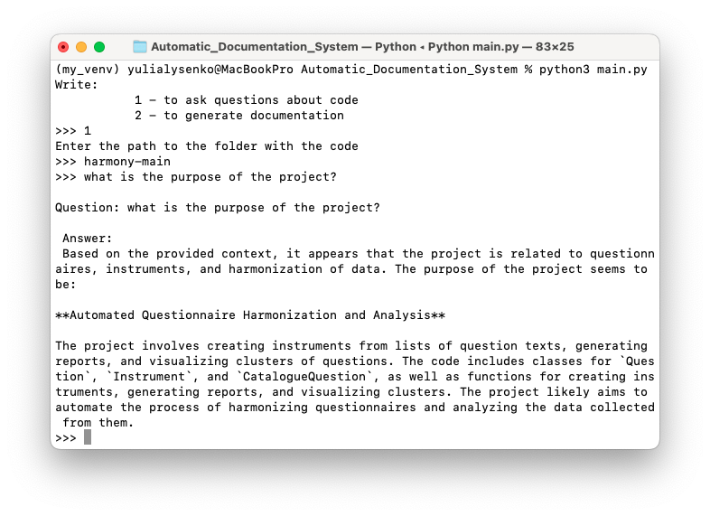
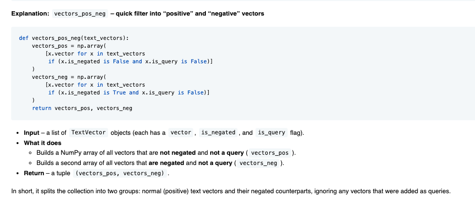

This is a project that helps understand a repository code. For testing, I randomly chose to use [Harmony](https://github.com/harmonydata/harmony) . It is an
open source tool, that helps psychologists to harmonise data and questionnaire items.

There are two ways of how to use **Automatic Documentation System**:

### 1. CHAT

User can add a folder with source code of a project, and use 
this project to analyse the code. In the chat the user can ask questions about the code.

Example:



### 2. Add Documentation

This project will automatically generate documentation for a repository. 
It will do so by parsing the code using *tree_sitter* library. Then it will divide files into 
chunks (e.g. class, function) and,using Langchain and Groq, will generate documentation. I ended up using two LLMs:
**"llama-3.1-8b-instant"** and **"openai/gpt-oss-20b"**. They both showed good results.

Example:




The rest of the generated documents can be found in [docs](docs).


To run this project, you must create an *.env* file and add a GROQ_API_KEY to it.

To run it in *docker container*, use the following commands:

```
docker-compose up --build

docker-compose run --rm --service-ports app python main.py

```


